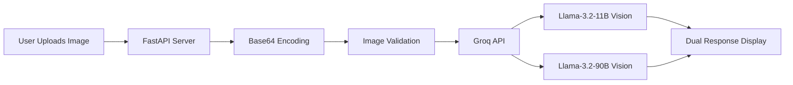

<div align="center">

# 🏥 AI Medical Chatbot — Vision-Powered Image Analysis

[](https://python.org)
[](https://fastapi.tiangolo.com)
[](https://groq.com)
[](LICENSE)

An intelligent medical image analysis chatbot that leverages **Llama 3.2 Vision** models through the Groq API to analyze medical images and answer user queries with AI-generated insights.

[Getting Started](#-getting-started) · [Features](#-features) · [Architecture](#-architecture) · [API Reference](#-api-reference) · [Contributing](#-contributing)

</div>

---

## 📌 Overview

**AI Medical Chatbot** is a web application that enables users to upload medical images (X-rays, scans, diagrams, etc.) and ask natural language questions about them. The system processes the image through **two Llama 3.2 Vision models** simultaneously, providing dual AI perspectives for more comprehensive analysis.

> ⚠️ **Disclaimer:** This tool is intended for **educational and research purposes only**. It is **not** a substitute for professional medical diagnosis. Always consult a qualified healthcare professional for medical advice.

---

## ✨ Features

| Feature | Description |
|---------|-------------|
| 🖼️ **Image Upload** | Drag-and-drop or click-to-upload medical images (JPEG, PNG, etc.) |
| 🤖 **Dual Model Analysis** | Simultaneous inference using **Llama-3.2-11B** and **Llama-3.2-90B** Vision models |
| 💬 **Natural Language Queries** | Ask questions about uploaded images in plain English |
| ⚡ **Real-Time Processing** | Fast inference powered by Groq's LPU hardware |
| 🎨 **Modern Dark UI** | Sleek glassmorphism interface with responsive design |
| 📝 **Markdown Rendering** | AI responses rendered with full Markdown support |
| 🔒 **Input Validation** | Server-side image format verification and error handling |

---

## 🏗️ Architecture

```
ai_medical_chatbot/
├── app.py              # FastAPI web server with upload & query endpoint
├── main.py             # Standalone CLI script for image analysis
├── templates/
│   └── index.html      # Frontend UI (Tailwind CSS + vanilla JS)
├── test1.png           # Sample test image
├── test2.jpg           # Sample test image
├── test3.png           # Sample test image
├── .env                # Environment variables (not tracked)
└── README.md
```

### How It Works



1. **User uploads** a medical image and types a question
2. **FastAPI backend** encodes the image to Base64 and validates the format
3. **Two parallel requests** are sent to Groq API using Llama 3.2 Vision models
4. **Both responses** are returned and rendered side-by-side in the UI

---

## 🚀 Getting Started

### Prerequisites

- **Python 3.10+**
- **Groq API Key** — [Get one free at groq.com](https://console.groq.com/keys)

### Installation

1. **Clone the repository**

   ```bash
   git clone https://github.com/SyedNadimMehdi30/ai_medical_chatbot.git
   cd ai_medical_chatbot
   ```

2. **Create a virtual environment** *(recommended)*

   ```bash
   python -m venv venv
   source venv/bin/activate        # Linux/macOS
   venv\Scripts\activate           # Windows
   ```

3. **Install dependencies**

   ```bash
   pip install fastapi uvicorn python-dotenv pillow requests jinja2 python-multipart
   ```

4. **Set up environment variables**

   Create a `.env` file in the project root:

   ```env
   GROQ_API_KEY=your_groq_api_key_here
   ```

### Running the Application

#### Web Application (FastAPI)

```bash
python app.py
```

The app will start at **http://localhost:8000**. Open it in your browser.

#### CLI Mode (Standalone)

```bash
python main.py
```

This runs a one-shot analysis on `test1.png` with a hardcoded query — useful for quick testing.

---

## 📡 API Reference

### `GET /`

Serves the main HTML page.

### `POST /upload_and_query`

Analyze an uploaded image with a text query.

**Request** — `multipart/form-data`

| Field   | Type   | Description                     |
|---------|--------|---------------------------------|
| `image` | File   | Image file (JPEG, PNG, etc.)    |
| `query` | String | Natural language question       |

**Response** — `application/json`

```json
{
  "llama": "Response from Llama-3.2-11B Vision model...",
  "llava": "Response from Llama-3.2-90B Vision model..."
}
```

**Error Response**

```json
{
  "detail": "Error description"
}
```

---

## 🛠️ Tech Stack

| Technology | Purpose |
|------------|---------|
| **FastAPI** | High-performance async web framework |
| **Groq API** | Ultra-fast LLM inference (LPU) |
| **Llama 3.2 Vision** | Multimodal vision-language models (11B & 90B) |
| **Jinja2** | Server-side HTML templating |
| **Tailwind CSS** | Utility-first CSS framework for UI |
| **Pillow** | Image validation and processing |
| **Marked.js** | Client-side Markdown rendering |

---

## 🔧 Configuration

| Environment Variable | Required | Description |
|---------------------|----------|-------------|
| `GROQ_API_KEY` | ✅ Yes | Your Groq API key for model inference |

---

## 🤝 Contributing

Contributions are welcome! Here's how you can help:

1. **Fork** the repository
2. **Create** a feature branch (`git checkout -b feature/amazing-feature`)
3. **Commit** your changes (`git commit -m 'Add amazing feature'`)
4. **Push** to the branch (`git push origin feature/amazing-feature`)
5. **Open** a Pull Request

---

## 📄 License

This project is licensed under the **MIT License** — see the [LICENSE](LICENSE) file for details.

---

## 🙏 Acknowledgments

- [Groq](https://groq.com) for providing ultra-fast LLM inference
- [Meta AI](https://ai.meta.com) for the Llama 3.2 Vision models
- [FastAPI](https://fastapi.tiangolo.com) for the excellent web framework

---

<div align="center">

**Built with ❤️ by [Syed Nadim Mehdi](https://github.com/SyedNadimMehdi30)**

⭐ Star this repo if you find it useful!

</div>